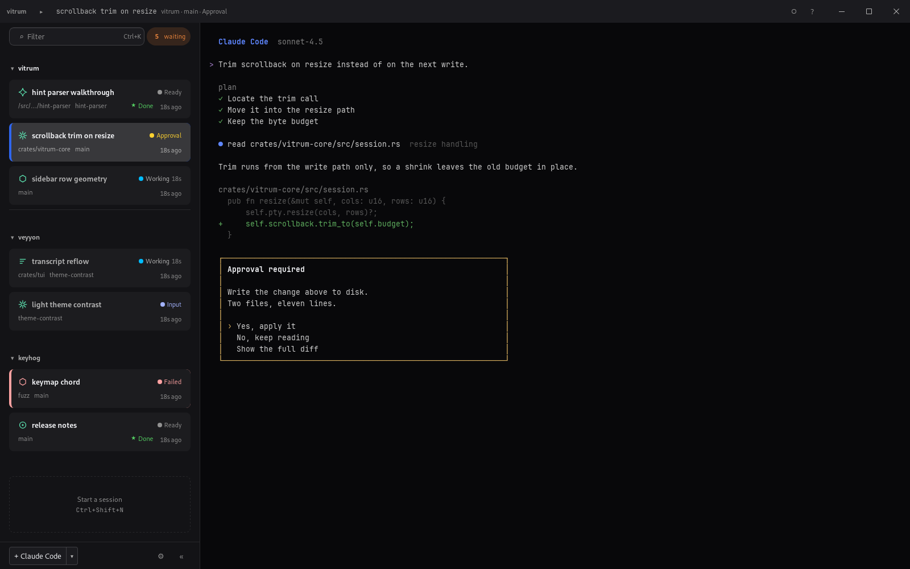
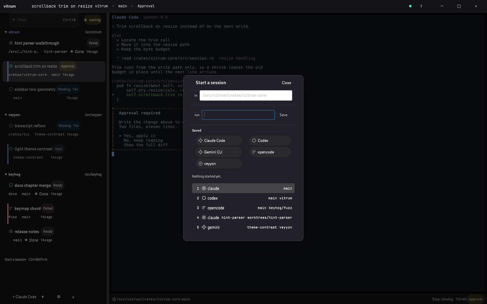
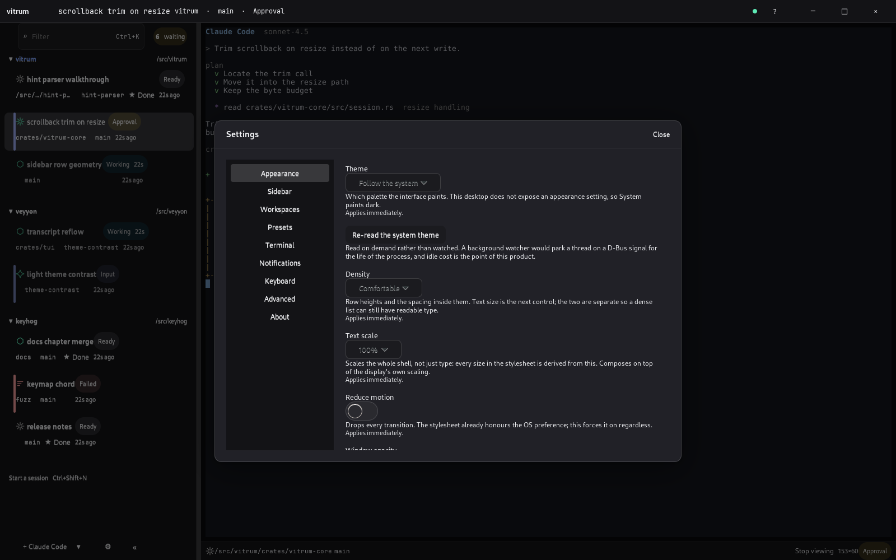

<h1 align="center">vitrum</h1>

<p align="center">
  <a href="https://github.com/santhreal/vitrum/releases/latest"></a>&nbsp;
  <a href="https://github.com/santhreal/vitrum/actions/workflows/ci.yml"></a>&nbsp;
  <a href="#license"></a>
</p>
<p align="center">
  
</p>


vitrum runs agent TUIs in one window: Claude Code, Codex, Gemini CLI, veyyon,
or any other command. Each session gets a row in a sidebar showing the agent,
the project directory, and the state.

| | |
|---|---|
| working | running |
| waiting for approval | blocked until you allow an edit or a command |
| waiting for input | blocked on a question |
| ready | finished |
| failed | exited |

`Ctrl+Shift+Down` selects the next session in one of the blocked states.

<p align="center">
  
</p>

<p align="center">
  
</p>

Sessions run in a daemon. Closing the window, or updating vitrum, does not stop
them, and scrollback is intact when you open it again.

## Install

Linux and macOS:

```sh
curl -fsSL https://raw.githubusercontent.com/santhreal/vitrum/main/install.sh | sh
```

Windows:

```powershell
irm https://raw.githubusercontent.com/santhreal/vitrum/main/install.ps1 | iex
```

Both scripts resolve the latest release, check the archive against the release
`SHA256SUMS`, install nothing on a mismatch, place `vitrum` and `vitrum-server`
on `PATH`, and add a launcher entry. `vitrum update` repeats that in place.

Linux needs a WebKit runtime: `libwebkit2gtk-4.1` on Debian and Ubuntu,
`webkit2gtk4.1` on Fedora, `webkit2gtk-4.1` on Arch. macOS and Windows ship one.

Building from source: [docs/install.md](docs/install.md).

## Features

Sidebar rows carry the agent's mark, the state, and the time since last output,
grouped by directory or by named folders.

Collision detection reports two live sessions that have written the same file.
Both rows show it. The later write wins and the earlier agent's edit is gone,
and nothing else in the toolchain reports an error. Linux only; other platforms
report that no watcher exists.

The daemon owns the PTYs. Agents survive the client. They do not survive the
daemon.

Every window shares one WebKit process. Twenty windows are three processes.
Numbers: [docs/performance.md](docs/performance.md).

Presets store a command with its directory and a key binding, callable from
anywhere in the app.

## Keys

`vitrum` opens an empty window. `Ctrl+Shift+N` opens a dialog taking a directory
and a command. `Ctrl+S` in that dialog stores it as a preset.

| | |
|---|---|
| `Ctrl+Shift+N` | new session |
| `Ctrl+Shift+Down` | next blocked session |
| `Ctrl+K` | filter the sidebar |
| `Ctrl+Shift+F` | search scrollback across sessions |
| `Ctrl+Tab` | next session |
| `Ctrl+Shift+X` | stop the focused session |

`F1` lists the rest.

## Documentation

| | |
|---|---|
| [install.md](docs/install.md) | source builds, desktop entries, uninstall |
| [states.md](docs/states.md) | how an agent declares approval and input |
| [appearance.md](docs/appearance.md) | opacity, backdrops, compositor blur |
| [remote.md](docs/remote.md) | running the daemon on another machine |
| [configuration.md](docs/configuration.md) | file locations, daemon flags |
| [performance.md](docs/performance.md) | measured memory and idle cost |
| [architecture.md](docs/architecture.md) | crate layout |

[CHANGELOG](CHANGELOG.md) · [CONTRIBUTING](CONTRIBUTING.md) ·
[SECURITY](SECURITY.md) · [RELEASING](RELEASING.md)

## Status

Pre-release, version 0.1.1. Linux is exercised end to end. macOS and Windows
compile and are untested. Collision detection is Linux only.

## License

MIT ([LICENSE-MIT](LICENSE-MIT)) or Apache-2.0 ([LICENSE-APACHE](LICENSE-APACHE)),
at your option. Contributions are dual licensed on the same terms unless you
state otherwise.

`vendor/` and `vendor-pty/` are forks of other projects, under the MIT license
and copyright they arrived with. `NOTICE` names them.
