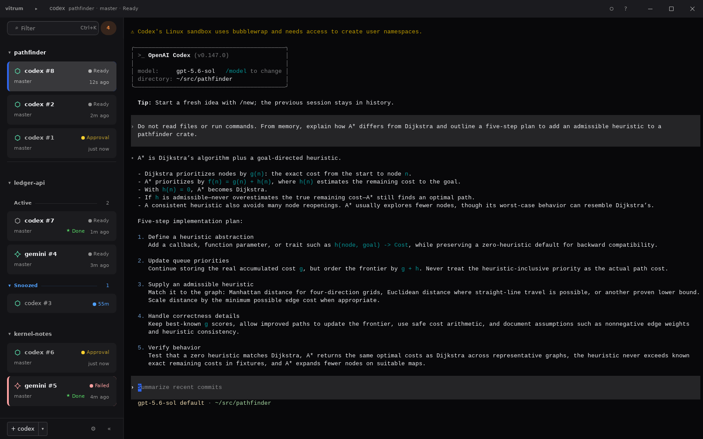

# Session states

A row carries the agent's mark, the session name, its branch and working
directory, one state, and the time since the session last printed. Rows group
by project, or by folders you name.

<p align="center">
  
</p>

| State | Source |
|---|---|
| working | observed |
| ready | observed |
| failed | observed |
| waiting for approval | declared by the agent |
| waiting for input | declared by the agent |

vitrum derives working, ready and failed from the process: what the foreground
program is blocked in, whether it is still printing, and how it exited. No
cooperation from the agent is needed.

Approval and input are not observable. A process waiting for an answer and a
process waiting for its next instruction are blocked in the same `read`. Until
an agent declares one of them, the row shows the observed state.

Some agents declare their state in the terminal title, and vitrum reads it.
Codex sets `[ ! ] Action Required`, which resolves to approval. A title is
recorded separately from the session name, so renaming a session does not
disable it.

## OSC 7373

```text
ESC ] 7373 ; <state> [ ; <label> ] ESC \
```

`<state>` is `approval`, `input`, `working` or `ready`. `<label>` is optional
text shown beside the row. Terminals that do not know the sequence ignore it.

`vitrum hint` writes it:

```sh
vitrum hint approval 'run `rm -rf build/`?'
vitrum hint input 'which file? a, b or c'
vitrum hint ready 'tests pass'
vitrum hint --clear
```

`--clear` declares `working`. That is the one state vitrum retires by itself
once the session goes quiet, which hands the row back to observation.

`vitrum hint` writes to stdout whether or not stdout is a terminal. It exits 0
after writing the sequence and 2 on an unknown state.

## From a shell prompt

`PROMPT_COMMAND` runs after each command, which is when the shell has gone back
to waiting:

```sh
PROMPT_COMMAND='vitrum hint ready "$(basename "$PWD")"'
```

zsh:

```sh
precmd() { vitrum hint ready "${PWD:t}" }
```

## From a wrapper

The trap clears the badge when the agent is killed mid-run, so the row does
not keep a stale `working`.

```sh
#!/bin/sh
# ~/.local/bin/claude-vitrum
trap 'vitrum hint --clear' EXIT INT TERM
vitrum hint working "$*"
claude "$@"
vitrum hint ready 'done'
```

## From Claude Code

A Claude Code hook cannot write the sequence directly: its stdout belongs to
Claude Code and it runs with no controlling terminal, so the sequence has to
reach the PTY another way.

[`integrations/claude-code`](../integrations/claude-code) contains the hook,
the `settings.json` entries that call it, and the event mapping.

## Working directory

A session's row is grouped under a project and shows the part of its working
directory that the project heading does not already give. A session at the
project root shows nothing extra. A session in a worktree beside the project,
or anywhere else, shows its own path.

The directory is the one the session is in now, not the one it was launched
in. An agent that changes directory reports the move with OSC 7:

```text
ESC ] 7 ; file://<host>/<path> ESC \
```

vitrum moves the session to that directory and resolves the branch there.
`<host>` is ignored. A path that does not exist is ignored.

bash and zsh emit OSC 7 from their prompt already, so a shell session follows
`cd` with no configuration. An agent that runs commands in a directory of its
own choosing writes the sequence itself:

```sh
printf '\033]7;file://%s%s\033\\' "$(hostname)" "$PWD"
```

Turn the column off in Settings under Sidebar. The session still moves and the
branch still follows it.

## Collisions

Two live sessions that have written the same file are reported on both rows.
The later write wins and the earlier agent's edit is gone, and nothing else in
the toolchain reports it.

Linux only. Other platforms report that no watcher exists.
